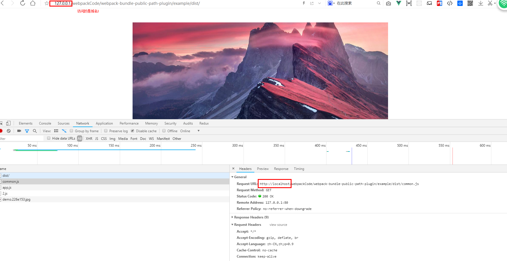
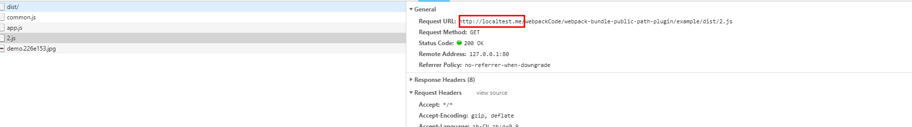

# webpack-bundle-public-path-plugin
> webpack5 dynamic override public path in webPage runtime.

#### 介绍
> 支持webpack5 动态改变webpack异步请求代码块（chunk请求前缀） **publicPath** 路径

##### 安装配置
```
npm i -D webpack-bundle-public-path-plugin
// 配置
const WebpackBundlePublicPathPlugin = require('webpack-bundle-public-path-plugin');

plugins:[
    // 顺序问题很重要,务必放在 HtmlWebpackPlugin 插件之前
    new WebpackBundlePublicPathPlugin(), // 默认取 window.g_config.publicPath 或者 window.globalConfig.publicPath
    // 或者 自定义配置带参数方式
    new WebpackBundlePublicPathPlugin({
        dynamicPublicPath:'"xxx code"'
    })
]

```

##### 使用方法
方法1: 在入口文件index.html中 head 标签添加 script 代码
```
  <script type="text/javascript">
    window.g_config ={
        publicPath:"http://localtest.me/webpackCode/webpack-bundle-public-path-plugin/example/dist/"
    }
  </script>
```
方法2
```
 window.globalConfig.publicPath = "http://localtest.me/webpackCode/webpack-bundle-public-path-plugin/example/dist/"
```

#### 参数
- dynamicPublicPath [String]
 > 自定义 publicPath 字符串或者 JS code

##### 适用场景
- 单页应用访问 域名1(www.a.com) index.html中配置的 静态资源链接：域名2(www.b.com)的css、js文件
- 开启**异步分包加载**(require.ensure或者import("资源")) 异步请求的代码块是当前 www.a.com/xx.chunk.js(实际是不存在的) 则无法正确访问到实际的位置 www.b.com/xx.chunk.js

##### 可能会遇到的问题
- 配合其他插件有有涉及 publicPath 的地方需要谨慎使用,比如 mini-css-extract-plugin 
```
// mini-css-extract-plugin 修复的方法如下
 {
    loader: MiniCssExtractPlugin.loader,
    options: {
        // 重置publicPath
        publicPath: (resourcePath, context) => {
            return "";
        }
    }
    },
```

##### 演示截屏
- 
- 

